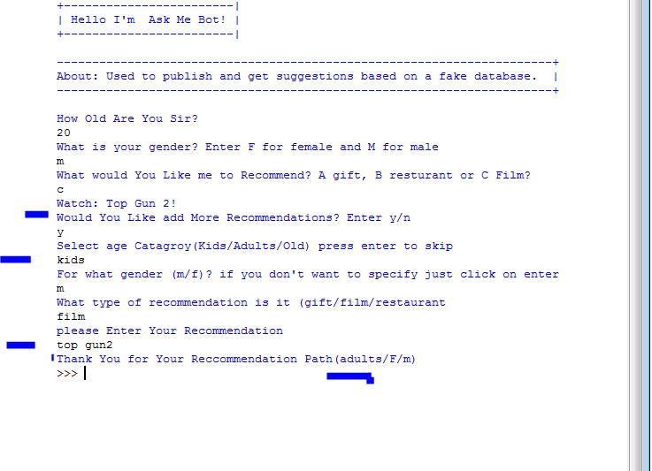

# challenge-1MAC-
Python application Used to publish and get suggestions based on a fake database

## How It Works:
    0. this applaction depend on Path (every recomend has it's path and also new recommends).
    1. The user will enter three inputs: age, gender and type of recommendation.
    2. The program  sort the user based on their age into 3 categories.
    less than 16 years old, from 16 years old to 40 and above 40 years old.
    3. The program sort the user based on their gender to either female or male.
    4. The program provide 3 types of categories: a gift, a film or a restaurant.
    5. The program provide different suggestions based on different inputs.
    6. The user can enter new suggestions from the terminal/shell.
    7.  general_recommends : a list stores untitled added recommendation
    to keep the applaction strong and smart.
    
## Extra missions:
    *. The program can filter user suggestion with  with not specific gender or age or type
    And  store them at general_recommends.
    *. The Program filter words like gun blod kill horror, etc.
    *. Try adding a movie called Top Gun, or blood, or etc. to recommends for kids section
    To check the app ability to protect kids section from spam!.
    
    
# Fake DataBase:

 #I used global variables to be able to check the new added suggestion from users
1. gift_a_female = ["Toy", "Barbie", "puzzle", "ipad", "mobile"]
2. gift_b_female = ["Perfume", "dress", "Hot Air Brush", "flowers"]  # gifts for > 16 female and < 40
3. gift_c_female = ["Necklace", "Ring", "Programmable Pressure Cooker"] # female > 40

4. rest_a_female = ["Super Kid Restaurant", "Zengo", "mcdonalds", "Margherita", "Wavebreaker", "Chuck E. Cheese's"]
5. rest_b_female = ["Izakaya", "Zengo", "Armani/Hashi", "Revo Cafe", "Sardina Seafood Restaurant", "Rockfish", "Market24", "Sansation", " The Hamptons Cafe" ]
6.rest_c_female = ["Margherita", "Bombay Brasserie","Al Dawaar Revolving Restaurant", "Sardina Seafood Restaurant", "Rockfish", "Market24", "Sansation", " The Hamptons Cafe" ]

7. film_a_female = ["Lego DC Super Hero Girls", "Frozen1", "Frozen2", "Lady and the Tramp", "Trolls Holiday", "Aladdin" ]
8. film_b_female = ["he Empire Strikes Back", "The Big Sick", "An Affair to Remember", "The Notebook", "The Apartment", "A Knight's Tale" ]
9. film_c_female = ["Manhattan", "Pretty Woman", "The Fly", "The Big Sick.", "Wings of Desire ", "Gone with the Wind" ]

10. gift_a_male = ["playStaion", "football", "computer", "mobile"] # males < 16
11. gift_b_male = ["Perfume", "wrist watch", "laptop", "Whey protein"] # males > 16 and < 40
12. gift_c_male = ["Perfume", "wrist watch", "suit", "Sun glasses", "car"] # males > 40

13. rest_a_male = ["Super Kid Restaurant", "Margherita", "mcdonalds", "subway", "burger king", "Wavebreaker" ]
14. rest_b_male = ["Wavebreaker", "Reform Social & Grill", " Margherita", "Bombay Brasserie", "Sardina Seafood Restaurant", "Rockfish" ]
15. rest_c_male = ["Benihana", "Solo Dubai", "Margherita", "Bombay Brasserie", "Al Dawaar Revolving Restaurant", "Rockfish" ]

16. film_a_male = ["Toy Story", "Wonder Park", "The Lion Kin", "Aladdin", "the boss baby", "Small Foot", "Avengers" ]
17. film_b_male = ["Joker", "Aladdin", "The Dead Don't Die", "Zombieland", "in the Tall Grass", "Top Gun 2" ]
18. film_c_male = ["Angry Men", "Citizen Kane", "Casablanca", "Apocalypse Now", "A Space Odyssey", "Psycho" ]
